### My Open Source Projects

- [Uptime Kuma](https://github.com/louislam/uptime-kuma) - Web / Docker - A fancy self-hosted monitoring tool
- [Dockge](https://github.com/louislam/dockge) - Web / Docker - A fancy, easy-to-use and reactive self-hosted docker compose.yaml stack-oriented manager
- [It's MyTabs](https://github.com/louislam/its-mytabs) - Web / Docker / Windows App - Web based, self hostable guitar/bass tab viewer and player, similar to Songsterr. 
- [RDP Portal](https://github.com/louislam/rdp-portal) - Windows App - A portable RDP manager like WinSCP or HeidiSQL
- [AkaiGrid](https://github.com/louislam/akaigrid) - Windows App - A fancy frontend for browsing your video folders on Windows.
- [More inactive or small projects](https://github.com/louislam?tab=repositories&q=&type=public&language=&sort=stargazers)...

### 🐣🐨🐻🐻‍❄️?????

- 🐨 Just another developer in the world
- ©️ Love C-like languages only
- 😏 Love Zero-config
- ✨ Simple is beautiful
- 🦥 Write less, do more
